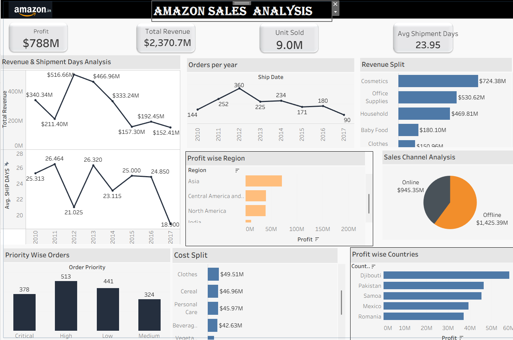

# Amazon-Sales-Analysis-Dashboard
Tableau dashboard for analyzing Amazon sales data

##  Project Overview

This project showcases an **interactive Amazon Sales Dashboard** built using **Tableau** to analyze sales performance, profit trends, shipment efficiency, and product-level insights.

##  Objective

* Analyze Amazon sales data to extract meaningful insights
* Monitor key business KPIs (Sales, Profit, Orders, Shipment Days)
* Understand regional and product-level performance
* Build a professional, interactive dashboard for decision-making

---

## Dashboard Pages & Features

### 1. AMAZON SALES ANALYSIS

* Total Profit: **$788M**
* Total Revenue: **$2.37B**
* Units Sold: **9.0M**
* Average Shipment Days: **23.95**

 Visuals:

* Profit by Region (Bar Chart)
* Profit by Country (Map Visualization)
* Sales Channel Analysis (Online vs Offline)
* Orders Trend (Year-wise)
* Order Priority Distribution
* Revenue Trend vs Shipment Days
* Year-wise performance comparison
* Revenue Split by Product Category
* Cost Split by Category
* Profit Analysis by Category

 Key Insight:

* Cosmetics and Office Supplies are top-performing categories in terms of revenue and profit

## Key Business Insights

* Sub-Saharan Africa and Europe generate high profits
* Offline sales channel dominates revenue contribution
* Shipment delays negatively impact revenue
* Cosmetics category leads in both revenue and profit

---

##  Tools & Technologies

* **Tableau** – Data Visualization & Dashboarding
* **Excel / CSV** – Data Source
* **Data Cleaning & Transformation Techniques**

